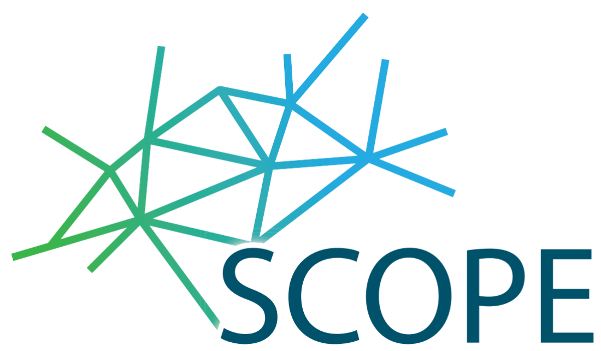
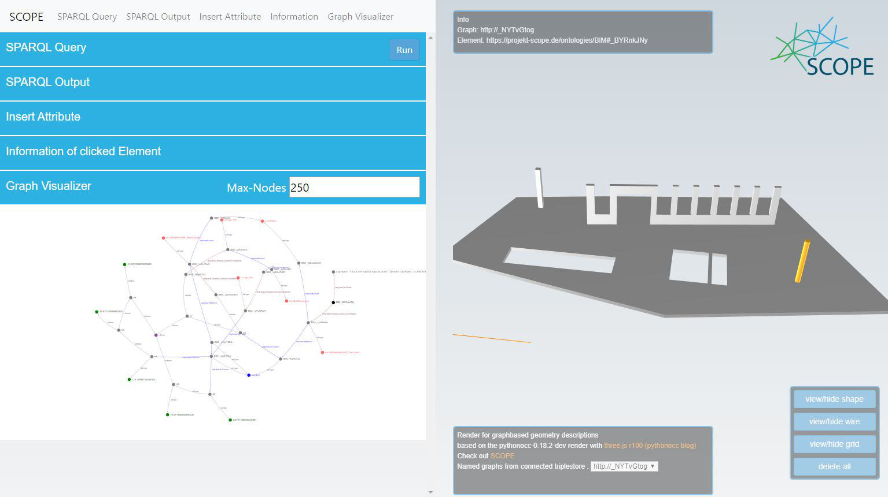

# SCOPE data service

Data service for RDF-based BIM representation including geometry.

## Description

The SCOPE data service consists of:
- Web service with Fuseki database
- Plugin for Autodesk Revit 2019 to export geometric and semantic information to Fuseki
- GUI for geometry visualization and SPARQL queries

Developed within:  SCOPE (www.projekt-scope.de) 
SCOPE is a German research project funded by the BMWi (Bundesministerium für Wirtschaft und Energie).

The SCOPE data service allows to create, store and visualize complex geometrical information with the help of the open-source geometry kernel openCASCADE. It consists of an Autodesk Revit 2019 exporter based on RevitPythonShell and a GUI for visualizing the 3D geometry and its RDF graph representation.

The RDF representation in Fuseki mainly uses the ontologies w3id.org/bot, w3id.org/bpo and w3id.org/occ.

## Installation

Docker and Make are required. In the base folder and with a running docker engine, start the services with "make up".

### Test run with python3:

Call "python serverTest.py" in ./services/client. The script creates some geometry in the Fuseki TDB which can be visualized at localhost:22634 after a couple of seconds.

### Test run with Autodesk Revit 2019 / RevitPythonShell:

Copy the script sendRevitdatatoTDB.py in ./services/client to RevitPythonShell and run it. The script exports some basic Revit families. Revit example files can be found in the same folder. Visualizing at localhost:22634 might take some minutes, we are currently working on improving the speed.

## Contact persons

- Christian Nothstein +49 711 7883 8978
- Tim Huyeng +49 6151 16-21333
- Dr. Wendelin Sprenger +49 711 7883 8692
